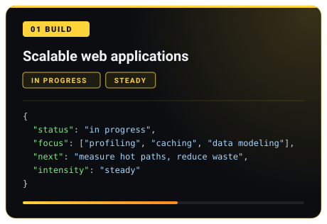
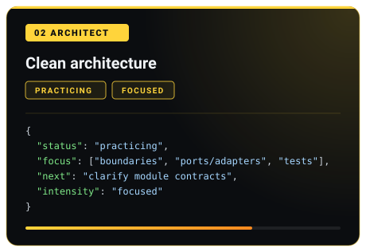
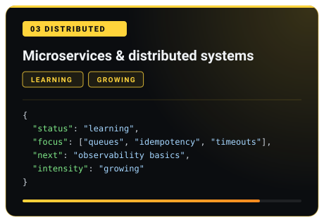
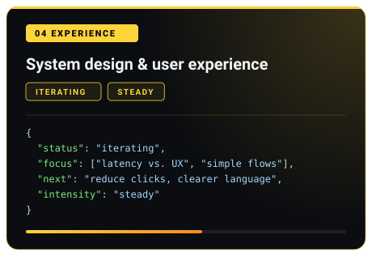

<div align="center">

<!--
  MODERN SAIYAN UI — PROGRAMMING POWER PROGRESSION
  Visual progression at the top intentionally uses transformation imagery only.
  No transformation names are shown in the UI; the labels are programming concepts.

  Visual references:
  SSJ1 / top image: https://tenor.com/view/goku-super-saiyan-super-saiyan-goku-ssj-transforming-gif-11980209914392833256
  SSJ2 / top image: https://gifs.alphacoders.com/gifs/view/208014
  SSJ3 / top image: https://tenor.com/view/goku-ssj3-power-up-gif-25641530
  SSJ4 / top image: https://tenor.com/view/goku-ssj4-goku-dragon-ball-dragon-ball-daima-ssj4-goku-kamehameha-gif-3303287068179576532
  SSJ5 / top image: https://tenor.com/search/pictures-of-goku-super-saiyan-5-gifs
  SSJ6 / fan artwork: https://www.pinterest.com/pin/694187730048093669/
  SSJ7 / fan artwork: https://www.deviantart.com/chronofz/art/Goku-Super-Saiyan-7-820012990
-->

<!-- ═══════════════════════════════════════════════════════════════════ -->
<!--                     POWER PIPELINE — ONLINE                        -->
<!-- ═══════════════════════════════════════════════════════════════════ -->


<br><br>


<br>


<br><br>

<!-- Transformation images: images only, no visible form names -->
<table align="center" border="0" cellpadding="8" cellspacing="0">
<tr>
<td align="center"></td>
<td align="center"></td>
<td align="center"></td>
<td align="center"></td>
<td align="center"></td>
<td align="center"></td>
<td align="center"></td>
</tr>
<tr>
<td align="center"><sub><b>INIT</b></sub></td>
<td align="center"><sub><b>COMPILE</b></sub></td>
<td align="center"><sub><b>DEBUG</b></sub></td>
<td align="center"><sub><b>BUILD</b></sub></td>
<td align="center"><sub><b>SHIP</b></sub></td>
<td align="center"><sub><b>OPTIMIZE</b></sub></td>
<td align="center"><sub><b>ARCHITECT</b></sub></td>
</tr>
</table>
<br>

<!-- One consistent gold divider -->


</div>

<br>

<!-- ═══════════════════════════════════════════════════════════════════ -->
<!--                              ABOUT                                  -->
<!-- ═══════════════════════════════════════════════════════════════════ -->

## 🟠  about


```javascript
const devProfile = {
  name: 'Mohamed Amine Ammar',
  role: 'Full Stack Developer',
  location: 'Tunisia 🇹🇳',
  focus: [
    'Scalable web applications',
    'Clean architecture',
    'Microservices',
    'System design & UX',
  ],

  ki_state: {
    mindset: 'consistent reps, honest feedback, small wins',
    energy: 'steady and growing',
    training_arc: 'shipping and learning in public',
    philosophy: 'readability > cleverness; measure, then optimize',
  },

  frontend: ['React', 'Next.js', 'TypeScript'],
  backend: ['NestJS', 'Go', 'Node.js'],
  devops: ['Docker', 'Git'],
  design: ['Figma'],

}

console.log('🟠 Saiyan dev console online.')
```

<br clear="both">

<div align="center">


<br><br>

<div align="center">


</div>

<br>

</div>

<!-- ═══════════════════════════════════════════════════════════════════ -->
<!--                              SKILLS                                 -->
<!-- ═══════════════════════════════════════════════════════════════════ -->

## 🟠 skills

<div align="center">


<br><br>

<div align="center">


</div>

<br>


</div>

<br>

<!-- ═══════════════════════════════════════════════════════════════════ -->
<!--                         MILESTONES WALL                             -->
<!-- ═══════════════════════════════════════════════════════════════════ -->

## 🟠 Milestones wall

<div align="center">

```ascii
╔══════════════════════════════════════════════════════════════════════════════╗
║  🎯 PERSONAL CHECKPOINTS | RANK: SAIYAN IN TRAINING | XP: GROWING          ║
╚══════════════════════════════════════════════════════════════════════════════╝
```


<br><br>

```yaml
training_focus:
  - 'Scalable web apps with clean boundaries'
  - 'Microservices fundamentals + messaging'
  - 'API contracts with strong TS types'
  - 'UX that respects user flow and time'
```

<br>


</div>

<br>

<!-- ═══════════════════════════════════════════════════════════════════ -->
<!--                    ACTIVE DEVELOPMENT FOCUS                         -->
<!-- ═══════════════════════════════════════════════════════════════════ -->

## 🐉 Active Development Focus

<div align="center">
  
</div>

<br>

<!-- Cards live in assets/cards/ (4 SVG files) -->
<div align="center">
  
  
  
  
</div>

<br>


<br>

<!-- ═══════════════════════════════════════════════════════════════════ -->
<!--                          COMMUNICATION                               -->
<!-- ═══════════════════════════════════════════════════════════════════ -->

## 🟠 Communication

<div align="center">


### 🐲 Connection established

<br>

<a href="https://www.linkedin.com/in/mohamed-amine-ammar" target="_blank">
  
</a>
<a href="mailto:ammar.mohamdamine@gmail.com" target="_blank">
  
</a>
<a href="https://mohamedamineammar-portfolio.vercel.app" target="_blank">
  
</a>
<a href="https://github.com/aminammar1" target="_blank">
  
</a>

<br><br>

```javascript
const contact = {
  linkedin: 'mohamed-amine-ammar',
  email: 'ammar.mohamdamine@gmail.com',
  portfolio: 'mohamedamineammar-portfolio.vercel.app',
  github: 'aminammar1',
  response_time: 'usually within a day',
  open_for: ['learning', 'collaboration', 'junior opportunities'],
}
```

</div>

<br><br>

<!-- ═══════════════════════════════════════════════════════════════════ -->
<!--                           FINAL STATE                                -->
<!-- ═══════════════════════════════════════════════════════════════════ -->

<div align="center">


<br><br>

<blockquote style="font-style: italic; color: #FFD43B; max-width: 760px; margin: auto;">
    "Power comes in response to a need, not a desire. You have to create that need." – Goku
</blockquote>

</div>